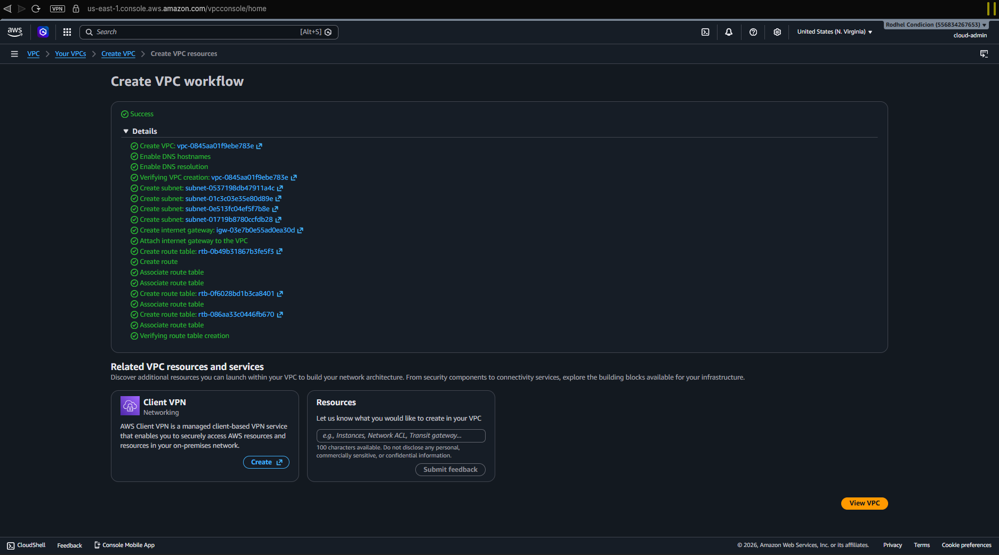
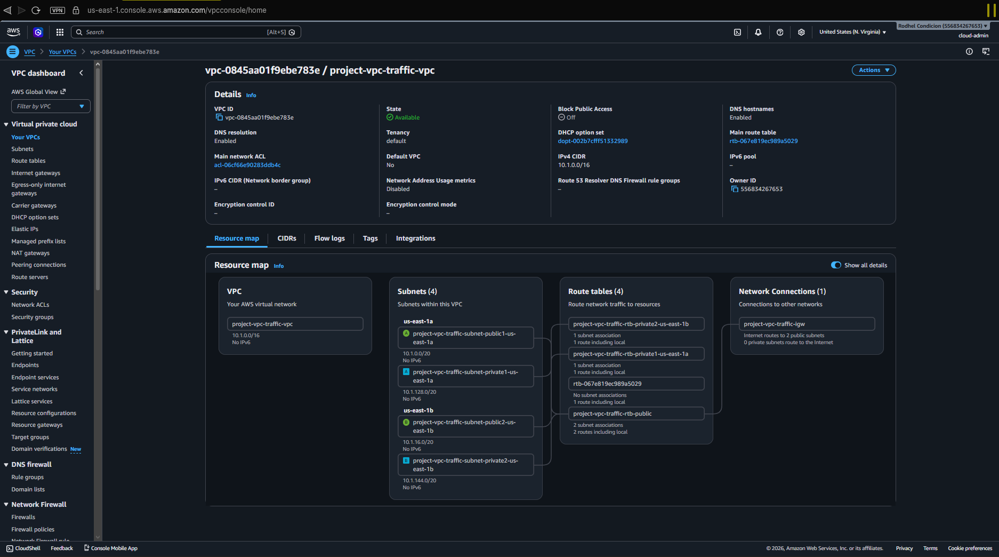
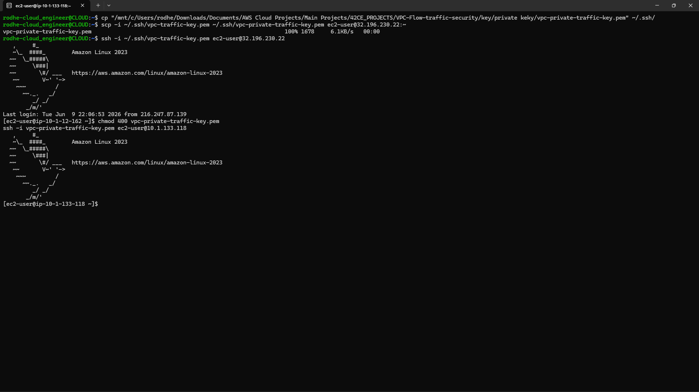
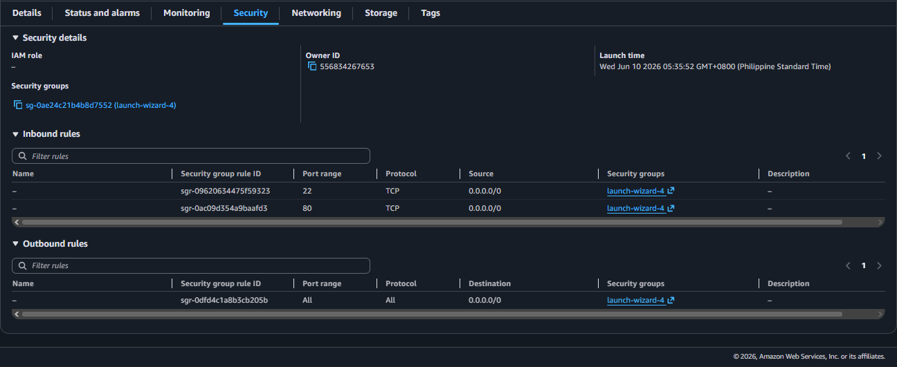
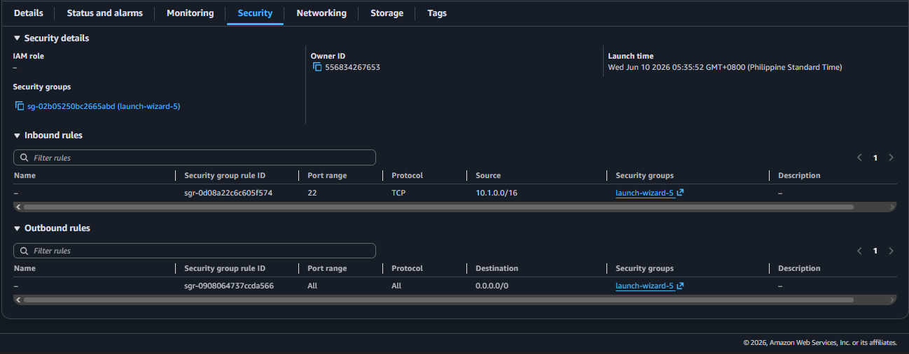
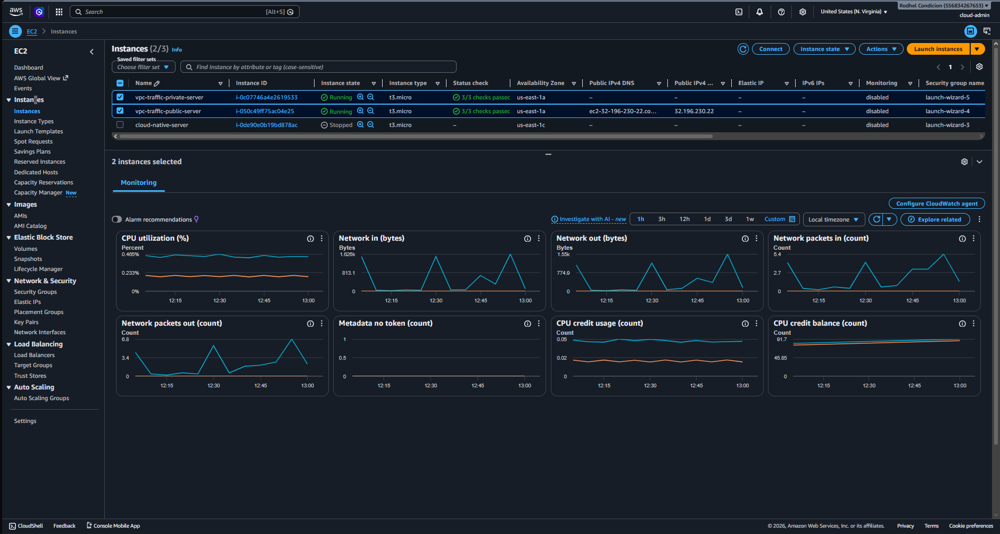

# AWS VPC Traffic Flow and Security

## Project Overview

This project demonstrates the design, deployment, and security implementation of a custom Amazon Virtual Private Cloud (VPC) environment in AWS. The architecture includes public and private subnets distributed across multiple Availability Zones, route tables, an Internet Gateway, Security Groups, EC2 instances, and monitoring capabilities.

The project was designed to provide hands-on experience with AWS networking concepts and to understand how traffic flows within a VPC while maintaining security through network segmentation and controlled access.

---

# Learning Objectives

By completing this project, I learned how to:

- Create and configure a custom Amazon VPC
- Design a network using public and private subnets
- Configure Internet Gateway connectivity
- Configure Security Groups for secure access
- Understand route tables and traffic routing
- Implement network segmentation
- Deploy EC2 instances in public and private subnets
- Establish secure communication between instances
- Monitor EC2 instances using AWS monitoring tools
- Build a highly available architecture across multiple Availability Zones

---

# Architecture Diagram

```text
                             Internet
                                 │
                                 ▼
                        Internet Gateway
                                 │
                                 ▼
┌─────────────────────────────────────────────────┐
│             VPC (10.1.0.0/16)                   │
│                                                  │
│ Availability Zone A                              │
│ ┌──────────────────┐     ┌──────────────────┐    │
│ │ Public Subnet    │     │ Private Subnet   │    │
│ │ Public EC2       │────▶│ Private EC2      │    │
│ └──────────────────┘     └──────────────────┘    │
│                                                  │
│ Availability Zone B                              │
│ ┌──────────────────┐     ┌──────────────────┐    │
│ │ Public Subnet    │     │ Private Subnet   │    │
│ └──────────────────┘     └──────────────────┘    │
└─────────────────────────────────────────────────┘
```

---

# AWS Resources Created

## VPC

| Configuration | Value |
|--------------|--------|
| Name | project-vpc-traffic-vpc |
| CIDR Block | 10.1.0.0/16 |
| DNS Resolution | Enabled |
| DNS Hostnames | Enabled |
| Tenancy | Default |

### Purpose

The VPC provides a logically isolated virtual network where AWS resources can be securely deployed and managed.

---

# Subnets

## Public Subnets

| Name |
|--------|
| project-vpc-traffic-subnet-public1-us-east-1a |
| project-vpc-traffic-subnet-public2-us-east-1b |

### Purpose

Public subnets host resources that require direct internet connectivity.

---

## Private Subnets

| Name |
|--------|
| project-vpc-traffic-subnet-private1-us-east-1a |
| project-vpc-traffic-subnet-private2-us-east-1b |

### Purpose

Private subnets host resources that should remain isolated from direct internet access.

---

# Availability Zones

| Availability Zone |
|-------------------|
| us-east-1a |
| us-east-1b |

### Purpose

Using multiple Availability Zones increases fault tolerance and supports high availability.

---

# Internet Gateway

| Configuration | Value |
|--------------|--------|
| Name | project-vpc-traffic-igw |

### Purpose

The Internet Gateway enables communication between resources in public subnets and the internet.

Without an Internet Gateway, public-facing resources would not be accessible externally.

---

# Route Tables

## Public Route Table

| Destination | Target |
|------------|--------|
| 10.1.0.0/16 | Local |
| 0.0.0.0/0 | Internet Gateway |

### Purpose

Routes internet-bound traffic from public subnets to the Internet Gateway.

---

## Private Route Table

| Destination | Target |
|------------|--------|
| 10.1.0.0/16 | Local |

### Purpose

Maintains isolation of private resources by preventing direct internet access.

---

# Security Groups

## Public EC2 Security Group

### Inbound Rules

| Type | Port | Source |
|--------|------|--------|
| SSH | 22 | My IP |
| ICMP | All | VPC Network |

### Purpose

Allows administrators to securely access the public EC2 instance while limiting exposure to unauthorized traffic.

---

## Private EC2 Security Group

### Inbound Rules

| Type | Port | Source |
|--------|------|--------|
| SSH | 22 | Public EC2 Security Group |
| ICMP | All | VPC Network |

### Purpose

Restricts access to the private instance and allows communication only from trusted resources within the VPC.

---

# EC2 Instances (Deployed)

| Configuration | Public Instance | Private Instance |
|--------------|----------------|------------------|
| Operating System | Amazon Linux 2023 | Amazon Linux 2023 |
| Architecture | 64-bit (x86) | 64-bit (x86) |
| Instance Type | t2.micro / t3.micro | t2.micro / t3.micro |
| Deployment | Public Subnet | Private Subnet |
| Internet Access | Yes | No |
| SSH Access | Direct | Through VPC |

### Purpose

The EC2 instances demonstrate secure deployment practices within a segmented VPC environment.

The public instance provides internet-facing access while the private instance remains protected from direct external communication.

---

# Understanding Traffic Flow

The following illustrates how internet traffic reaches resources inside the VPC:

```text
Internet
   │
   ▼
Internet Gateway
   │
   ▼
Public Route Table
   │
   ▼
Public Subnet
   │
   ▼
Public EC2 Instance
   │
   ▼
Private EC2 Instance
```

### Traffic Flow Summary

1. External users connect through the Internet Gateway.
2. Traffic is routed using the Public Route Table.
3. Requests reach the Public EC2 instance.
4. The Public EC2 instance can communicate securely with the Private EC2 instance.
5. Private resources remain inaccessible directly from the internet.

---

# Monitoring and Observability

AWS monitoring tools were used to observe the health and performance of both EC2 instances.

Metrics monitored include:

- CPU Utilization
- Network In
- Network Out
- Instance Status Checks
- Resource Availability

Monitoring ensures operational visibility and helps identify performance or connectivity issues.

---

# Security Concepts Demonstrated

- Network segmentation using public and private subnets
- Secure remote administration using SSH
- Security Group implementation
- Route-based traffic management
- Controlled internet access
- Isolation of private resources
- Multi-Availability Zone architecture
- Infrastructure monitoring and observability

---

# Skills Demonstrated

- AWS Networking
- Amazon VPC
- CIDR Planning
- Route Tables
- Security Groups
- Internet Gateway Configuration
- EC2 Deployment
- Linux Administration
- Cloud Monitoring
- Infrastructure Documentation
- AWS Architecture Design
- Network Security Fundamentals

---

# Screenshots

## VPC Creation Workflow

Shows the complete VPC deployment process including subnet creation, route table configuration, and Internet Gateway attachment.



---

## Resource Map

Displays the visual relationship between networking components deployed within AWS.



---

## Public EC2 Terminal and Private EC2 Terminal

Demonstrates successful SSH access to the EC2 instance located in the public subnet.



---

## Public Security Group

Shows inbound and outbound rules configured for the public EC2 instance.



---

## Private Security Group

Shows inbound and outbound rules configured for the private EC2 instance.



---

## EC2 Monitoring Dashboard

Displays monitoring metrics and operational status for both deployed instances.



---

# Key Takeaways

This project provided practical experience in designing and deploying AWS networking infrastructure while applying cloud security best practices.

Key lessons learned include:

- Building isolated networks using VPCs
- Managing traffic flow using route tables
- Securing resources using Security Groups
- Designing multi-tier cloud environments
- Deploying and managing EC2 instances
- Monitoring cloud infrastructure

---

# Conclusion

This project successfully demonstrates the implementation of a secure AWS networking environment using Amazon VPC. Public and private subnets were deployed across multiple Availability Zones, and EC2 instances were launched to validate routing, connectivity, and network isolation.

Security Groups were configured to enforce controlled access, while AWS monitoring tools provided visibility into instance health and performance. The architecture serves as a strong foundation for advanced AWS services such as NAT Gateways, Load Balancers, Auto Scaling Groups, Bastion Hosts, and multi-tier application deployments.

This project highlights practical cloud networking, infrastructure design, and security skills commonly required for Cloud Engineer, AWS Solutions Architect, and DevOps Engineer roles.
